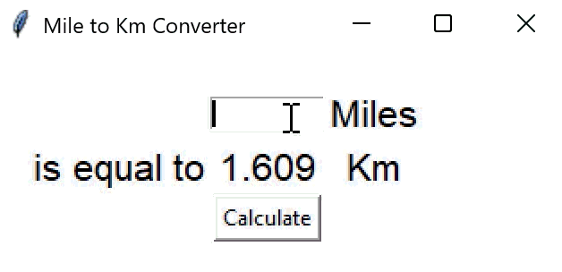

<h1>Day 27 of the 100 Days of Code: The Complete Python Pro Bootcamp</h1>

For the Day 27 challenge, I created a GUI Program that converts miles (input from users) to kilometer. This is a culmination of the teaching points that were shared in the tutorial, including the following but not limited to

<ul>
  <li>tkinter module, *args, *kwargs</li>
  <li>functions</li>
</ul>

> [!TIP]
> It is interesting to not only learn about the history of Graphic User Interfaces but also the many different functions that the tkinter module offers and their endless possibilities!

  

<h2>Why am I doing this?</h2>

I have learned python before in school but I hope to revisit some of the python concepts that I may have forgotten and at the same time delve further into python, especially in the field of data science and visualisation.

<h2>You can join me too!</h2>

 Check out the 100 Days of Code: The Complete Python Pro Bootcamp udemy course through this <a href="https://www.udemy.com/course/100-days-of-code/">link</a>.

